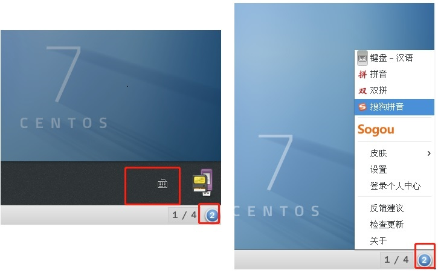

# 准备工作
## 配置epel源
```
sudo yum -y install epel-release.noarch
```
# 安装fcitx
## 安装fcitx及相关工具
```
sudo yum install qtwebkit alien dpkg opencc redhat-lsb fcitx fcitx-pinyin fcitx-configtool im-chooser
```
## 结束ibus进程
```
sudo pkill ibus-daemon
```
## 关闭gnome-shell对键盘的监听
```
gsettings set org.gnome.settings-daemon.plugins.keyboard active false
```
## 切换输入法fcitx
```
imsettings-switch fcitx
```
如果下述的命令执行没有问题,则在~/.bashrc中添加以下的内容并reboot系统:
```
export XMODIFIERS=@im=fcitx
export GTK_IM_MODULE=fcitx
export QT_IM_MODULE=fcitx
export XIM=fcitx
```
# 安装搜狗拼音输入法
## 下载搜狗拼音
下载地址: http://pinyin.sogou.com/linux/?r=pinyin
选择Linux 64位版本,下载的文件名类似:sogoupinyin_2.2.0.0108_amd64.deb
## 转换deb为rpm包
```
sudo yum install alien
sudo alien -vcr sogoupinyin_2.2.0.0108_amd64.deb
```
## 安装搜狗拼音输入法
```
sudo rpm -ivh --force sogoupinyin-2.2.0.0108-2.x86_64.rpm
cp /usr/lib/x86_64-linux-gnu/fcitx/fcitx-sogoupinyin.so /usr/lib64/fcitx/
```
## 重载fcitx
```
fcitx -r
```
## 添加搜狗输入法
```
fcitx-configtool
```
在弹出框中,选择查找sogou并添加搜狗输入法
## 选择使用搜狗输入法
点击桌面右下角数字图标,里面有一个键盘的图标,在其中选择搜狗输入法即可,具体如下图所示:
