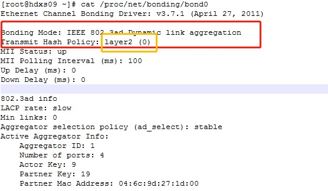
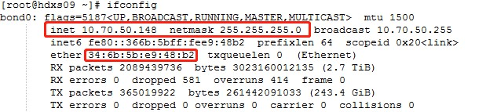
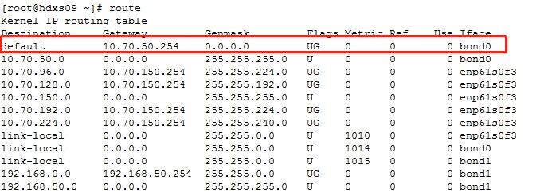
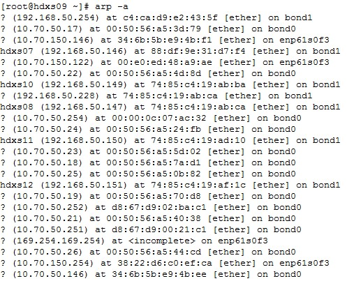

# 现象
服务器网卡使用绑定,出现上传多块网卡有流量,但是下载只有一块网卡有流量的现象.
# 服务器网卡bond0的配置


从上图可以看出:
- bond0使用的绑定模式是: LACP（Link Aggregation Control Protocol）
- bond0使用的发送策略是: XOR（此处根据Transmit Hash Policy看出layer2这个就是xor）

# XOR算法
bond0使用的发送XOR算法，就是使用源MAC地址与目的MAC地址进行异或，然后再余上slave的count。

# 下载只有一个网卡有流量的原因分析
环境详细情况如下:
1. bond0的mac地址以及网段信息，具体如下图所示：

    

1. 网关信息，具体如下图所示：

    

1. mac地址和ip的对应关系,具体如下图所示:

    

1. 下载的客户端有: 10.70.63.80，10.70.63.81，10.70.63.82，10.70.63.83，10.70.50.23

XOR算法使用的目的mac地址如下:
   - 因为10.70.63.80，10.70.63.81，10.70.63.82，10.70.63.83与server不在一个网段，所以send至这四个客户端的的目的mac地址都应该是网关10.70.50.254的mac地址。
   - 10.70.50.23的目的mac地址就是10.70.50.23的mac地址
XOR计算过程如下图所示:
```
In [1]: bond0 = int('34:6b:5b:e9:48:b2'.replace(':', ''), 16)
In [2]: mac23 = int('00:50:56:a5:5d:02'.replace(':', ''), 16)
In [3]: mac254 = int('00:00:0c:07:ac:32'.replace(':', ''), 16)
In [4]: (bond0 ^ mac23) % 4
Out[4]: 0
In [5]: (bond0 ^ mac254) % 4
Out[5]: 0
```
可以看出，向10.70.63.80，10.70.63.81，10.70.63.82，10.70.63.83，10.70.50.23这五个客户端发送全部都使用一个网卡。

# 如何避免下载流量只在一个网卡
方法一: 调整客户端
首先客户端最好在10.70.50网段，不在10.70.50网段的下载都只能使用一个网卡
对于在10.70.50，通过上节中截图的方法，计算一下，发送使用的网卡应该是哪个，让多块网卡都是用起来。

方法二：修改绑定模式
通过配置BONDING_OPT="mode=4 xmit_hash_policy=layer2+3", 使得Transmit Hash Policy成为: layer2+3
此时的XOR算法将变为同时使用mac地址和ip, 避免不是一个局域网的所有流量都在一个网卡上
